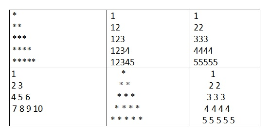

# Assignment - 3 | 2024-03-10 | Due On March 11, 2024 

1.	Write a program that reads a number from the user and prints its factorial.
2.	Write a program that reads a string from the user and prints it in reverse order.
3.	Write a program in C++ to find the number and sum of all integers between 1 and 50 which are divisible by 2.
4.	Write a program in C++ to find the length of a string without using in-built function.
5.	Write a program in C++ to display a pattern mentioned in the table below using for loop.
    
6.  Write a program to enter length of all sides of the triangle and on the basis of the input program should display the output whether the triangle is a right angled triangle or not.
   
